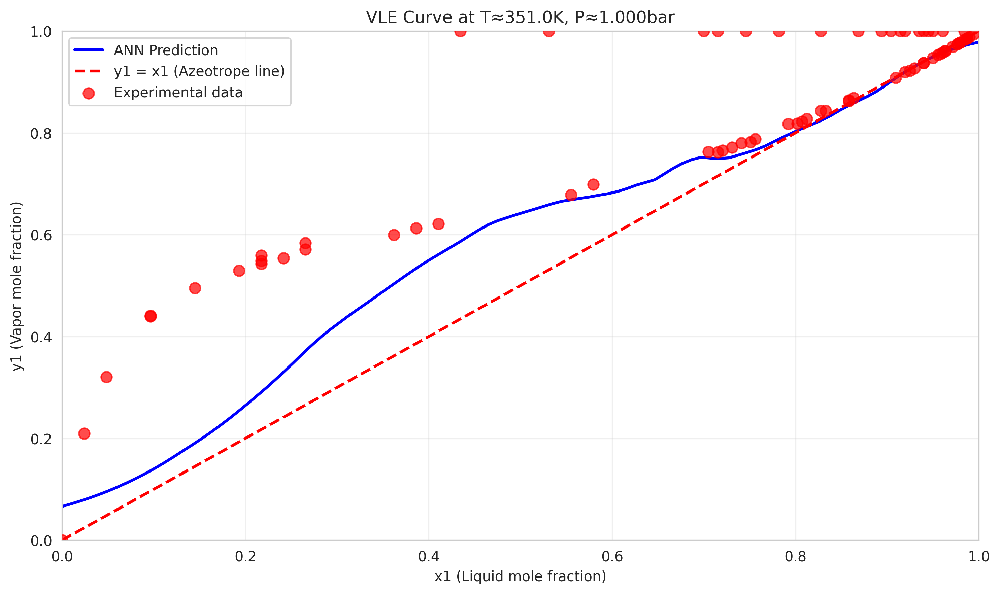
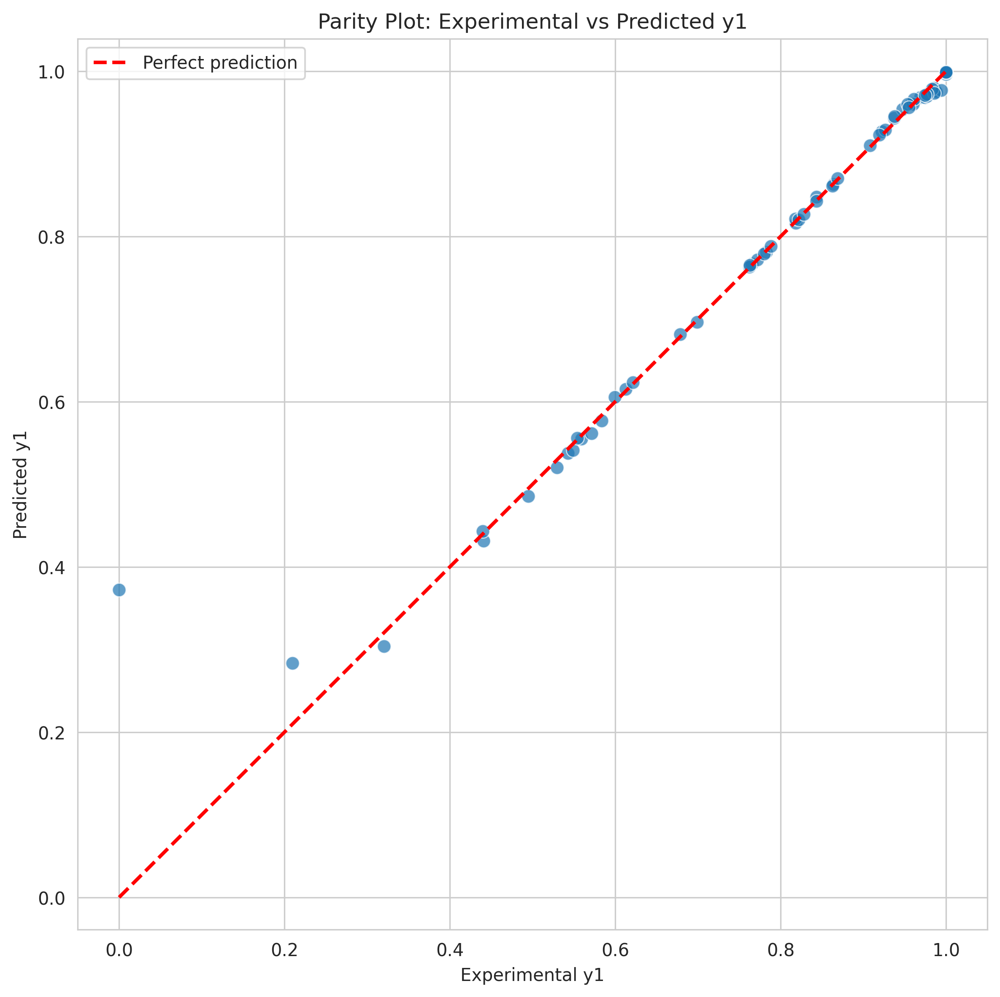

# Binary VLE ANN Surrogate Model

## What is Vapor-Liquid Equilibrium (VLE)?

Vapor-Liquid Equilibrium (VLE) is a fundamental concept in chemical engineering that describes the relationship between the compositions of liquid and vapor phases when they are in equilibrium at a given temperature and pressure. For binary systems like ethanol-water, this relationship determines how the components distribute between the liquid and vapor phases.

In distillation processes, VLE data is crucial for:
- Designing distillation columns
- Optimizing separation processes
- Predicting product compositions
- Calculating energy requirements

## What is an Azeotrope?

An **azeotrope** is a special type of VLE behavior where the vapor and liquid compositions become identical at a specific composition. This means that at the azeotropic point, the liquid mole fraction (x1) equals the vapor mole fraction (y1), making it impossible to separate the components further by simple distillation.

**Key characteristics of azeotropes:**
- **Minimum-boiling azeotrope**: The mixture boils at a lower temperature than either pure component
- **Maximum-boiling azeotrope**: The mixture boils at a higher temperature than either pure component
- **Azeotropic composition**: The specific composition where x1 = y1

For ethanol-water systems, there is a minimum-boiling azeotrope at approximately 95.6% ethanol by volume (89.4% by mole), which is why absolute ethanol cannot be obtained by simple distillation.

## What This Model Does

This project uses an **Artificial Neural Network (ANN)** to create a surrogate model that predicts VLE compositions for ethanol-water systems. Instead of using complex thermodynamic equations (like NRTL or UNIQUAC models), the ANN learns the relationship between:

- **Input**: Liquid composition (x1), Temperature (T), Pressure (P)
- **Output**: Vapor composition (y1)

**Key advantages:**
- **Fast predictions**: Instant results vs. iterative thermodynamic calculations
- **High accuracy**: Achieves <1% error on test data
- **Easy integration**: Simple API for process simulation software
- **Azeotrope detection**: Automatically identifies azeotropic behavior

## Model Performance

Based on the training results from the notebook:

### Accuracy Metrics
- **MAE (Mean Absolute Error)**: 0.009789
- **RMSE (Root Mean Squared Error)**: 0.044143
- **Model Parameters**: 16,897 trainable parameters
- **Model Size**: 66 KB

### Azeotrope Detection
The model successfully detects the ethanol-water azeotrope at:
- **Azeotropic composition**: x1 = 0.8124 (81.24% ethanol by mole)
- **Temperature**: 350.98 K (77.83°C)
- **Pressure**: 1.000 bar
- **Detection accuracy**: |y1 - x1| < 0.000019

### Baseline Comparison
- **ANN Model MAE**: 0.009789
- **Raoult's Law Baseline MAE**: 0.093034
- **Improvement**: ~9.5x better than simplified baseline

## Model Architecture

```
Input Layer:     3 neurons (x1, T, P)
Hidden Layer 1:  64 neurons (ReLU activation)
Hidden Layer 2:  128 neurons (ReLU activation)
Hidden Layer 3:  64 neurons (ReLU activation)
Output Layer:    1 neuron (Sigmoid activation for y1 ∈ [0,1])
```

**Training Configuration:**
- Optimizer: Adam (learning rate = 0.001)
- Loss Function: Mean Squared Error (MSE)
- Regularization: Early stopping (patience = 20 epochs)
- Batch Size: 32 samples
- Max Epochs: 200

## Visualization Results

### VLE Curve (y-x Diagram)


This plot shows the relationship between liquid composition (x1) and vapor composition (y1) at constant temperature and pressure. The blue line represents ANN predictions, red circles are experimental data, and the red dashed line (y1 = x1) indicates the azeotrope condition. The model accurately captures the azeotropic behavior where the curve approaches the y1 = x1 line.

### Model Performance Validation


The parity plot compares experimental vs predicted y1 values. Points close to the diagonal red line indicate accurate predictions. The model shows excellent agreement with experimental data, with most points clustered tightly around the perfect prediction line.

## Setup Instructions

### Option 1: Using pip with requirements.txt

```bash
# Clone the repository
git clone <repository-url>
cd vle3

# Create virtual environment
python -m venv venv
source venv/bin/activate  # Windows: venv\Scripts\activate

# Install dependencies
pip install -r requirements.txt
```

### Option 2: Using uv (recommended)

```bash
# Clone the repository 
git clone <repository-url> 
cd vle3 

# Install uv (macOS/Linux) if not available 
curl -LsSf https://astral.sh/uv/install.sh | sh 

# Create & activate virtual environment 
uv venv .venv 
source .venv/bin/activate  # on Windows: .venv\Scripts\activate 

# Install dependencies strictly from uv.lock 
uv sync --frozen 

# To update the lockfile later
# uv lock --upgrade && uv sync 
```

## Usage

### Quick Start
```bash
# Run complete training pipeline
python preprocessing_training_saving.py

# Make predictions with saved model
python predict_from_saved_model.py

# Interactive analysis
jupyter notebook test.ipynb
```

### Programmatic Usage
```python
import numpy as np
from predict_from_saved_model import predict_from_saved

# Predict vapor composition for x1=0.5, T=350K, P=1.0 bar
X_new = np.array([[0.5, 350.0, 1.0]])
y_pred = predict_from_saved(X_new)
print(f"Predicted y1: {y_pred[0]:.4f}")
```

## Project Structure

```
vle3/
├── ANN.py                           # Core ANN model definition
├── data.py                          # NRTL data generation
├── preprocessing_training_saving.py # Main training pipeline
├── predict_from_saved_model.py      # Prediction utilities
├── test.ipynb                       # Interactive analysis notebook
├── Data/vle_data.csv                # Training dataset (500 points)
├── requirements.txt                 # Dependencies for pip
├── pyproject.toml                   # Dependencies for uv
└── ANN_BinaryVLE/                   # Pre-trained model package
    ├── ann_vle_model.h5            # Trained model
    ├── preprocessing_pipeline.pkl   # Data scalers
    ├── best_model.weights.h5       # Best weights
    ├── parity_plot.png             # Performance validation
    ├── y_vs_x_plot.png             # VLE curve visualization
    ├── residuals_plot.png          # Error analysis
    ├── training_history.png        # Training progress
    └── baseline_parity_plot.png    # Baseline comparison
```

## Dataset

The model is trained on 500 VLE data points generated using the NRTL thermodynamic model:

- **Composition Range**: x1 = 0.000 - 1.000 (ethanol mole fraction)
- **Temperature Range**: T = 323.2 - 386.6 K (50-113°C)
- **Pressure Range**: P = 0.263 - 1.974 bar (0.26-1.95 atm)
- **Data Split**: 70% training, 15% validation, 15% test

## Requirements

- Python 3.11+
- TensorFlow 2.20+
- scikit-learn, pandas, numpy, matplotlib, seaborn, scipy, joblib, jupyter

## Applications

- **Distillation Column Design**: Optimize tray efficiency and reflux ratios
- **Process Simulation**: Fast VLE calculations in Aspen Plus/HYSYS
- **Real-time Control**: Online composition monitoring
- **Process Optimization**: Minimize energy consumption
- **Quality Control**: Ensure product specifications

## License

This project is licensed under the MIT License.